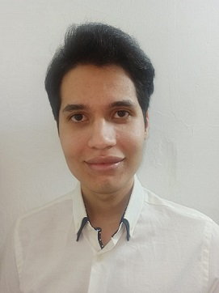

  

    

      
    

    

      

        I am a Colombian computer scientist from
        Ciénaga, Magdalena. I am currently a researcher in digital image
        processing and applied bioinformatics at Universidad Nacional de
        Colombia. My main areas of interest lie in computer vision and in the application of image
        processing algorithms to biological images. As for software development,
        I love to implement data engineering and data visualization workflows
        that enable other professionals to obtain insights from data. Starting
        on Fall 2021, I will be a Computer Science Ph.D. student at Northeastern University, in
        Boston.
      

    

     
  

  

    

      

        Since 2019, I collaborate with Professor <a href="https://genetics.wisc.edu/staff/schwartz-david/">David C. Schwartz</a>'s Laboratory
        for Molecular and Computational Genomics @ University of Wisconsin -
        Madison. As part of my work there, I have developed algorithms for
        processing images and signals toward the development of a novel genome
        mapping system.
      

    

  

<h2>Education</h2>

  

    
<strong>2020/08 - 2021/06</strong>

    

      Specialization in Analytics and Data Science at Univ. de Antioquia
    

  

  

    
<strong>2018/08 - present</strong>

    

      B.A. in English-French-Spanish Translation at <a href="https://www.udea.edu.co/wps/portal/udea/web/inicio/unidades-academicas/idiomas/acerca-escuela/quienes-somos">Univ. de Antioquia</a>
    

  

  

    
<strong>2018/02 - present</strong>

    

      M.Sc. in Systems Engineering at Universidad Nacional de Colombia
    

  

  

    
<strong>2012/08 - 2017/09</strong>

    

      B.Sc. in Systems Engineering at <a href="https://www.unimagdalena.edu.co/presentacionPrograma/Programa/2">Universidad del Magdalena</a>
    

  

## News

- 2021/06: Participated in the Data Umbrella Latin America Sprint and submitted my first PR to the scikit-learn project
- 2021/06: Completed the graduate specialization in Analytics and Data Science at Universidad de Antioquia
- 2021/04: The GeoAI team at South Pole, which I am part of, was awarded with a 15,000 USD (in Azure credits) grant by Microsoft to develop ML models for land cover classification
- 2021/02: Admitted to Northeastern University's CS Ph.D. program!
- 2020/08: Awarded the <a href="https://www.fulbright.edu.co/resultadosposgrados2020/">Fulbright Ph.D. scholarship</a>
- 2020/07: Joined South Pole as a Computer Vision Engineer
- 2019/07: Awarded a 'Joven Investigador' research grant by COLCIENCIAS
- 2019/05: Did a research visit to the LMCG at UW-Madison
- 2019/04: Joined the Colombia Wisconsin One Health Consortium

## Activities and other courses

- <strong>2021 - present:</strong> Member of the Computational Neurosciences student group at Universidad de Antioquia
- <strong>2020/04 - 2020/06:</strong> Undertook the 3-months intensive AI-readiness <a href="https://c1-web.correlation-one.com/">Data Science 4 All</a> program, taught by Correlation One.
- <strong>2019 - present:</strong> Cofounder of the TecnIA student research group at Universidad Nacional de Colombia, focused on introducing undergraduates from various backgrounds to data analysis and machine learning

## Teaching

- Instructor @ Universidad de Antioquia:
  - Programming Fundamentals (Summer 2021, MISION TIC program)
- Graduate Teaching Assistant @ Universidad Nacional de Colombia:
  - Artificial Vision (Semesters 2018-II, 2019-I, and 2019-II). Materials available at <https://github.com/alceballosa/Vision-Artificial-UNALMed>
  - Programming Fundamentals (Semester 2018-I)
- Undergraduate Teaching Assistant @ Universidad del Magdalena:
  - Mathematical Reasoning & Representation (Semester 2015-I)